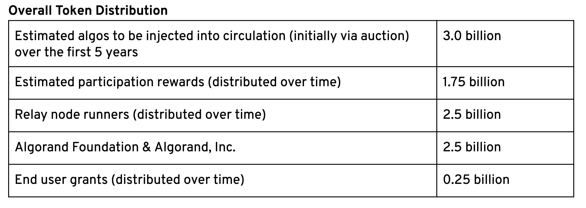

## Where does the governance happen?

Algorand's [governance](https://algorand.foundation/governance) happens largely within the Algorand Foundation, with the idea that it will grow into something with community involvement in the long term. 

> The Algorand Public Blockchain seeks to have a constitution and long term governance structure designed with community involvement. More details on our constitutional assembly and governance policies/processes will be shared soon.

For now, the foundation has [Economic](https://algorand.foundation/eac) and [Technical](https://algorand.foundation/technical-advisory-committee) Advisory Committees, which each list 2 members, so seem to be a work in progress.

You can see the submission guidelines for Economic Improvement Proposals [here](https://algorand.foundation/economic-improvement-proposal-guidelines). The Economic Advisory Council has a large role to play in deciding which proposals are considered and what the terms are, and arranges votes of the community (seems to only involve relay nodes so far), with proposals that have majority support being implemented by the EAC. This amounts to a form of signalling which has so far been used to change the reward structure for relay nodes, being approved by the 80 or so active relay nodes. 

Relay nodes also vote on protocol amendments, the Foundation's blog seems to be the place where these are [announced](https://algorand.foundation/voting-procedure-eip09092019pc) and results [reported](https://algorand.foundation/long-term-vesting-plan-vote-result). 

## Consensus

Algorand uses Proof of Stake consensus whereby participating nodes are selected probabilistically based on the number of “algos” they hold. Algorand refers to their specific system as "Pure Proof of Stake" (PPoS), it is different to other forms of PoS in that there are [two classes of nodes](https://developer.algorand.org/docs/algorand-node-types) ("relay nodes" and "participation nodes"). Participation nodes propose and vote on blocks and have weight according to the number of "algos" staked with them. Relay nodes handle transaction throughput, they are powerful servers which do the bulk of the network's heavy lifting.

The ["pure" in Algorand's PPoS](https://www.algorand.com/what-we-do/technology/pure-proof-of-stake/) relates to the absence of a locking requirement to participate, PPoS participants can spend their algos at any moment and are not subject to any penalties.

Delegation does not feature heavily because there is a low minimum requirement to participate in Pure Proof of Stake, but I believe it may be technically possible.

Although the requirement to participate in PPoS is low in algo terms (25 algos or around $5), participants [must complete **KYC/AML**](https://algorand.foundation/200millionalgo-staking-rewards-kyc-extended) processes before they can collect rewards. 

* *How are changes to the consensus rules implemented?*

Economic and Technical changes are implemented in different ways. For Economic changes the EAC reviews the proposed change (if it already seems to have community support) and will arrange a vote after soliciting and summarizing feedback on the proposal.

So far a number of proposals have been considered and approved for voting by the EAC, all relating to the reward schedule for relay nodes. Rewards were initially [suspended](https://algorand.foundation/vote-results-relay-node-runners-suspension-of-daily) until agreement could be reached on how to reform their vesting or issuance schedule. In early December 2019 a new [proposal](https://algorandfoundation.cdn.prismic.io/algorandfoundation/eb2a8c69-2262-42f8-99a4-09df485207b5_EIP-11252019AF_+Conditional+Accelerated+Vesting+Nov+30.pdf) was [approved](https://algorand.foundation/long-term-vesting-plan-vote-result) to extend the schedule of relay node rewards from 2 years to 5 years, also increasing them by 25% and adding provision for issuance to speed up in the event of a significant price rise.

One of the defining features of Algorand's governance is compliance, all of the nodes are known entities (they have to complete KYC/AML checks) and the procedure for approving economic changes includes [Formal Docusign waivers](https://algorand.foundation/voting-procedure-eip09092019pc) being signed by the nodes that vote yes.

> Based on the terms in the Node Agreements, a vote of the node runners to change the rewards schedule will be binding provided the consent of both: (i) the Algorand Foundation and (ii) parties to the Node Agreements who collectively run a majority of the Nodes currently under operation pursuant to that group of Node Agreements. The Algorand Foundation confirms it will provide its consent if the majority of nodes vote in favor of the proposal.

In this case 55 of the 81 relay nodes which were on 2-year vesting schedules (the only participants in the vote were those entities who are receiving the rewards) voted Yes to the change, with only 1 No vote and 25 abstentions. Once the Foundation had received a majority of the signed Docusign notices, it started to implement the change, due to activate before the suspension of node rewards expires on Dec 31 2019. 

Technical changes or "[network upgrades](https://algorand.foundation/protocol-development)" are pre-approved by the Technical Advisory Council and commence an activation countdown once >=90% of nodes have applied the update with the latent rule changes. 

## Coin/Token Distribution

Algos are the [native tokens](https://algorand.foundation/token-dynamics) of Algorand, they are entirely pre-mined and distributed by the Algorand Foundation.

> The Total Supply of Algos will be a 10 billion Algos.  The full 10 billion Algos will be minted in the genesis block with the following distribution:

This was amended in a later [update](https://algorand.foundation/algo-dynamics) where it was clarified that 2 Billion Algos would go to Algorand Inc and 0.5 Billion to the Algorand Foundation.

The Algorand Foundation and Algorand Inc. assigned themselves 25% of all the Algos there will ever be at launch, and the Foundation has another 30% of the total Algo issuance to sell at its discretion, initially in auctions. The Algorand founder organizations thus directly control and profit from 55% of the Algo supply, receiving both the proceeds of token sales and a large allocation of Algo tokens (which it has stated it will stake, but not too aggressively, allowing other ecosystem participants to have a say, within the scope that the Foundation deems reasonable).

Relay nodes and participation nodes (staking rewards) account for 42.5% of the issuance between them, with the final 2.5% going to end user grants.

The plan outlined by the Algorand Foundation is to distribute all 10 billion tokens in the first 5 years, with the network switching to transaction fee rewards after that point. The issuance of rewards was calibrated to taper off over the 5 year period, but it is already being amended by the network's participants so this timeframe is probably obsolete already and the Foundation has not announced a new target.

The first Algo Dutch auction incorporated offers by the Foundation to buy back the Algo tokens and burn them from anyone who wished to obtain a refund. After selling 25 million Algos for a clearing price of $2.40, 20 million were returned and burned when their buyers decided they wanted their funds back. There remains an open offer to the holders of the remaining Algos to buy them back at 90% of the auction price in June 2020.

# Funding

Algorand Inc. appears to do most of the core development in house, but the Foundation has also opened a [development awards program](https://algorand.foundation/algo-algorand-blockchain-developer-awards-incentive) where developers who have a working application on the Algorand blockchain can apply for funding. The Algorand Foundation will judge the application and make an award in line with their perception of its usefulness. 

The Foundation has released its first [transparency report](https://algorand.foundation/algorand-foundation-transparency-report----june-19th) on how many tokens are being introduced into circulation in which ways. According to this report the node runner rewards were by far the largest point of entry for Algos to the market, with 330M being issued before this was [halted by the nodes themselves](https://algorand.foundation/vote-results-relay-node-runners-suspension-of-daily). Participation rewards amounted to 96M in the same period. The report indicates how only 5 million Algos were sold in the auction (after refunds were issued), implying that a much greater amount were then awarded for the use of those Algos.

The Foundation also [states](https://algorand.foundation/algo-dynamics) that grants were given to relay nodes in advance of their participation, with these grants being issued on vesting schedules. 

Algorand Inc also produced a [transparency report](https://www.algorand.com/resources/blog/algorand-transparency-report) covering Jun-Nov 2019, stating that it does not sell tokens on the secondary market but had been using them to:

* Invest in various things (111M Algos or ~$27M), mostly "Algo Capital" which received a 100M Algo investment. 
* Support development of the financial ecosystem by encouraging growth and liquidity through support of partner solutions including lending collateral to establish lending markets (52.5M Algos, ~$13M),  staking, and market making (18.5M Algos, $~4.5M).

Algorand Inc has made a commitment to remain below 49% of stake participation at all times, so it's collecting around half of the Algos issued in this way. Algorand Foundation also participate in staking.

## Significant Entities

Between them the Algorand Foundation and Algorand Inc dominate the Algorand project, the great majority of issued Algos will flow through them in one way or another, and for the foreseeable future they will between them have full control of how the Algorand blockchain develops. 