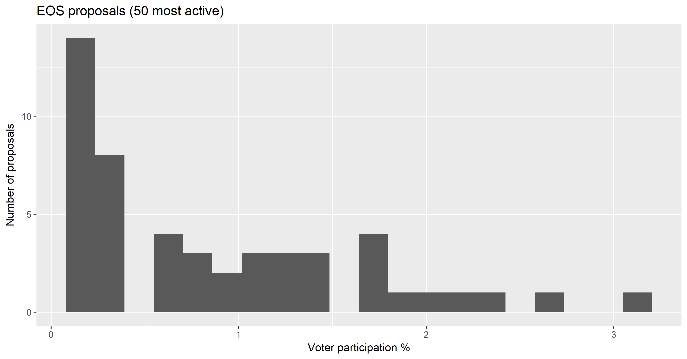

### Where does the governance happen?

EOS governance is the almost exclusive domain of the 21 Block Producers (BPs), with a supermajority of 15/21 BPs required to adopt any change to the consensus rules.

Most of the major decisions seem to be communicated in Telegram channels by representatives of Block.one and the BPs. 

# Blockchain Governance

- *Does the project have its own blockchain or is it a token on another chain? (many questions are not relevant for tokens)*

  The EOS token was originally an erc-20 token on the Ethereum blockchain, issued to participants in a [year-long ICO which raised $4 billion for Cayman Islands startup Block.one](https://cointelegraph.com/news/eos-about-to-secure-a-record-4-bln-in-year-long-ico). 

  The EOS mainnet launched in June 2019, after [a few false starts and generally hard time](https://thenextweb.com/hardfork/2018/06/08/eos-mainnet-nightmare/), with security issues uncovered by audits and phishing attacks on Block.one's email address book.

- *What is the mechanism for ensuring consensus about the state of the blockchain?*

  EOS uses Delegated Proof of Stake (DPoS) consensus, with 21 active Block Producers taking it in turns to produce new blocks in a form of Byzantine Fault Tolerant DPoS (the chain is highly resistant to forking and will more likely stall if something goes wrong). The Block Producers who get to create blocks and receive rewards are those which the EOS holders have delegated their staking rights to - the 21 BPs with the most delegated EOS voting power.

  Voting power associated with a delegation decays unless it is refreshed.

  EOS BPs must run nodes that have relatively high specifications to participate in block production - this is fundamental to EOS' solution to scaling and allowing a large number of transactions per second. 

- *Which entities interact with the blockchain? What role does each entity play? How are the "block producers" selected?*

  Only BPs add new blocks to the chain, and they have exercised considerable discretion in changing the consensus rules 

  The best source I have found for info about how EOS is set up is the [EOS whitepaper](https://github.com/EOSIO/Documentation/blob/master/TechnicalWhitePaper.md), followed up with medium articles from various BPs since the mainnet launch about changes to the consensus rules or collective decision-making of BPs. You can follow some of these changes in the {significant events file for EOS}.

  EOS BPs are rewarded with 1% inflation funding, which mostly goes to the 21 active BPs. These rewards are divided according to the amount of delegated EOS the BP controls, with a bonus for the 21 BPs who are active. "Standby BPs" can collect a smaller reward for whatever amount of delegated stake they have.

  This [article by Steve Floyd](https://medium.com/eostribe/how-eos-block-producers-are-paid-7b2a1216eb2b) has a good description and graphic explaining BP rewards.

- How are changes to the consensus rules implemented?

When 15 of 21 active BPs agree to change the consensus rules, they can coordinate the activation of the change between themselves. Beyond changing the consensus rules, the BPs can coordinate to achieve specific aims.

An example of this occurred shortly after EOS launch in June 2018, when the [EOS Core Arbitration Forum (ECAF) responded to complaints of private keys being stolen by ordering BPs to freeze 27 accounts](https://www.coindesk.com/eos-blockchain-arbitrator-orders-freeze-of-27-accounts). The BPs coordinated to freeze these accounts by agreeing not to process transactions from them, and maintained this freeze-out until February 2019, when a newly active BP was rotated in and [did not apply the blacklist, allowing some of the funds to be moved](https://medium.com/@eos42/proposed-solution-for-a-broken-blacklist-ce1c18bdf81c).                       

This locking of accounts proved controversial, as it was not clear how the ECAF would resolve the disputes, and the EOS community appeared to lose enthusiasm for such arbitration. The ECAF had been part of the [EOS constitution](https://github.com/EOSIO/eos/blob/5068823fbc8a8f7d29733309c0496438c339f7dc/constitution.md), a document outlining rules for participation in the network which all users and BPs had to agree to. The constitution also had other rules which presented issues with enforcement, like rules against lying and vote buying, and soon after launch Block.one made it known that they were looking to replace the constitution.

The EOS constitution also called for a referendum tool through which EOS holders could vote directly on issues related to the network, with the idea being that the BPs would implement these decisions if they met a quorum requirement of 15% EOS voting and 10% more voting Yes than No. 

EOS referendums [went live in January 2019](https://medium.com/hkeos/what-you-missed-in-eos-1-7-2019-1-20-2019-3ab666d4eb01), and saw an initial burst of activity, but the proportion of circulating EOS that votes in these polls is low (maximum of 2-3% of EOS voting) and has dropped over time.

For this analysis I have only included the top 50 referendums by turnout, data from [EOS Authority](https://eosauthority.com/polls). There have been around 200 proposals in total according to EOS Authority, but many of these are effectively spam proposals with no votes. There is no fee to submit a referendum poll and no gatekeeper to filter out spam. [One](https://eosauthority.com/polls_details?proposal=proposalcost_20190112) of the more popular referendums suggests adding such a fee. 

{voter turnout over time}

{Replacing constitution, burning WPS, as examples of referendum then BP action}

- How were/are coins distributed? Was there an ICO? Is there inflation now? Is there a fixed supply?

  

  

# Funding

- What is the reference node implementation?
- Any other full node implementations?

### How is development funded?

EOS launched with 5% inflation and 4% of this was to be used to fund to a Worker Proposal System, but the WPS is in the process of being abandoned and its savings have been burned. 

- Donations
- ICO
- Block reward
- Foundation/company
- Grants
- Not public/known

##### How much or what proportion from each type of source?

###### How are funds managed?

- Non-profit foundation
- For-profit company
- Community voting/DAO mechanism

#### What is the scope of funded work?

### Related projects

Are there any significant projects which are related? For example, is this a fork of another project? Have other projects forked this one? 

### Significant Entities

Name:

Type: profit/non-profit

Activity type: Investment, grant-making, product/service delivery

Managed how:

Founded when and by who

Size: Resources, Employees

Links to coins/chains other than the one in question

### Governance overview

