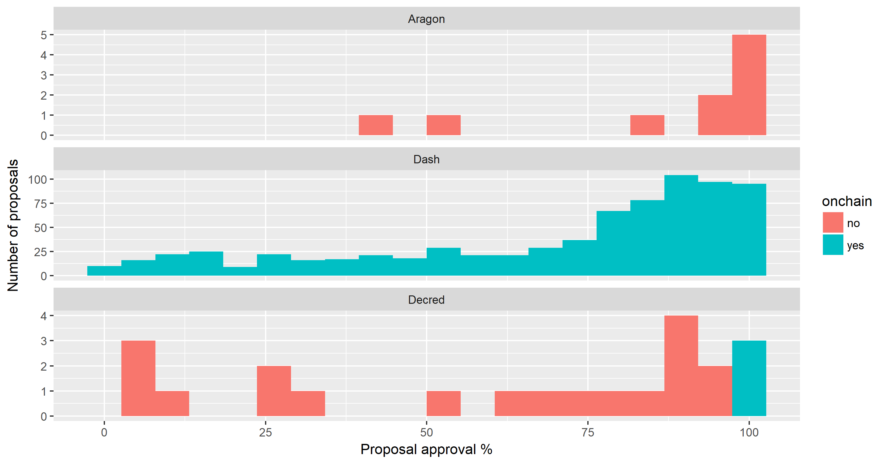

This folder is for storing blockchain governance data-sets. Specifically, there is a [template](proposal-template.csv) for quantitative proposal data which records outcomes and participation rates.

The precise definition of a proposal and what it covers varies from project to project. I have defined it as any issue that is resolved through a binding vote.

The intention is to collect and share this kind of data for every blockchain project that has a formal role for voting in its governance. 

If you know of a good source for this kind of data covering other projects, please open an Issue. If you have this kind of data to hand and can put it in the standardized form, feel free to open a Pull Request.

### Decred

* [Politeia proposals](decred-proposals.csv) 
* [On-chain consensus rule change proposals](decred-proposals-onchain.csv)

Decred has two types of "proposal" in this sense, [Politeia proposals](decred-proposals.csv) concerning project Treasury spending and policies, and [on-chain](decred-proposals-onchain.csv) votes about changes to the consensus rules. Decred voters are ticket-holders, people who time-lock their DCR for [tickets](https://docs.decred.org/proof-of-stake/overview/) and vote when their tickets are called. Tickets play an integral role in securing the network and forcing coherence around a single chain.

For a Politeia proposal to pass it must have at least 60% yes votes and at least 20% of the eligible tickets must vote on it. For each Politeia proposal, the eligible voters are the live tickets at the time when proposal voting opened, and the holders of these tickets can vote from their wallet at any time in the voting period (default 1 week).

Politeia proposals and voting is off-chain, but the Politeia platform anchors data in the blockchain so that it cannot be silently tampered with or censored. Proposals cost 0.1 DCR (~$2) to submit and are screened by admins before publication. Proposal submitters receive a censorship token which they can use to demonstrate that they submitted a specific proposal, if it is censored. So far 2 Politeia proposals have been censored.

Since Politeia launched in October 2018 there have been 19 proposals which have completed voting. Average (mean and median) participation of eligible tickets is 31%.

Decred's on-chain voting relates to modifying the network's consensus rules. To trigger a consensus rules change vote, new software that implements a rule change must first be adopted by 75% of voters and 95% of miners. After a voting period of 8,064 blocks (~28 days) in which 5 tickets vote yes or no on the proposal in each block, a proposal must have 75% yes votes to pass and at least 10% of the tickets must vote yes or no. So far there have been 3 consensus rules change proposals that have completed voting (all in 2017), with a mean of 76% tickets voting yes/no (as opposed to abstaining).

Politeia proposal data was collected from the proposal [mainnet](https://github.com/decred-proposals/mainnet) repository, using code developed through the [pi-research](https://github.com/RichardRed0x/pi-research) project. Decred consensus rules voting data was collected through [voting.decred.org](https://voting.decred.org/) and [dcrdata](https://explorer.dcrdata.org/agendas).

### Dash

* [Dash proposals](dash-proposals.csv)

Dash proposals and voting are [on-chain](https://docs.dash.org/en/stable/governance/index.html), and the proposal system operates on a monthly (16616 blocks) timetable. Dash voters are [masternode](https://docs.dash.org/en/stable/masternodes/index.html) operators, each masternode must hold 1,000 DASH as collateral, and maintain a node which meets a certain specification. Masternodes facilitate [Instantsend and Privatesend](https://docs.dash.org/en/stable/introduction/features.html) transactions.  

There is a limited amount of DASH available in each [superblock](https://docs.dash.org/en/stable/governance/understanding.html#budget-allocation), and it is awarded to the proposals which have the highest Yes - No score (proposals must also satisfy a condition that their yes - no score is greater than 10% of the active masternodes). At the time of the superblock, the winning proposals are paid out and when there are no more eligible proposals that can be paid with the remaining DASH, the remainder is burned. 

Dash proposals predominantly relate to Treasury spending, although there are a few which have been used to signal for other decisions. It costs 5 DASH ($650) to submit a proposal. 

Dash proposals can last for multiple superblock cycles, when they request payments broken up over a period of months. In these cases there are multiple votes per proposal (one per superblock), although the masternode votes persist between superblock cycles (unless the masternode operators change them). For the Dash data-set the numbers presented are for the final superblock vote.

Although Dash's proposal submission and voting occurs on chain, platforms like [Dash Central](https://www.dashcentral.org/) facilitate discussion and voting, while a variety of others show proposal voting data (including [Dash Nexus](https://app.dashnexus.org/proposals/leaderboard), [Dash vote tracker](http://dashvotetracker.com/), [Dash Ninja](https://www.dashninja.pl/) and [Dash Intel](https://dashintel.org/)). The data in this repository were collected through the Dash Intel API. I have previously conducted some more in depth [analysis](https://medium.com/@richardred/observations-of-the-dash-treasury-dao-c94231b2b5c4) of Dash Treasury data.

In total there have been 758 Dash Treasury proposals (starting August 2015), with mean masternode participation of 19% (median 18%).

### Aragon

* [Aragon proposals](Aragon-proposals.csv)

Aragon governance proposals (AGPs) concern the "management, allocation, or use of shared resources owned or directly influenced by the Aragon Network" - the [AGP process](https://github.com/aragon/AGPs/blob/master/AGPs/AGP-1.md) itself was the first proposal to be [approved](https://blog.aragon.org/final-results-from-the-agp-1-vote/). Aragon's governance proposal process operates in quarterly cycles. Proposals are submitted on GitHub and reviewed by the Aragon Association. There are two tracks, "meta track" proposals have an approval requirement of >66.66% while the rest require a simple >50% majority. All circulating ANT tokens are eligible to vote on these proposals. Voting takes place through an Ethereum [Dapp](https://mainnet.aragon.org/#/governance.aragonproject.eth/0x277bfcf7c2e162cb1ac3e9ae228a3132a75f83d4), and that is where the data has been collected from. 

In the [first round](https://blog.aragon.org/final-results-from-aragon-network-vote-1/) of proposal voting, completed in January 2019, 12 proposals were submitted and 3 were not approved by the Aragon Association, leaving 9 to be voted on.

In total (including AGP-1) there have been 10 AGPs put to a vote, with mean ANT participation of 4.5% (median 3.5%).

### Comparing participation and outcomes between projects

")

This comparison is a little harsh on Aragon because the percentage is calculated based on the circulating supply, whereas for Decred/Dash it only considers those who are actively participating in Proof of Stake/Service as eligible voters. Decred has the highest participation rates of these three projects, with participation in on-chain consensus votes being particularly high.

The outcomes for proposals in terms of approval rates are quite different between projects. A high proportion of Aragon proposals received almost unanimous support, and there are no proposals which have been strongly rejected. Most Dash proposals have relatively high approval rates, with proposals that didn't make the cut being quite evenly distributed over the rest of the range. Decred proposals tend to have approval percentages which are more towards the extremes, with more proposals at the very low end of the range.