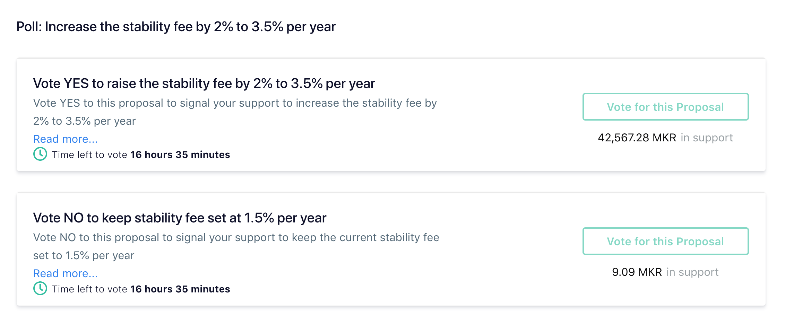

February saw MKR holders voting in two separate 0.5% increases in the Stability Fee for Collateralized Debt Positions (CDPs). Key factors leading to the decision included a DAI exchange rate persistently below $1, high inventory levels among market makers and prop desks, and no attributable impact from previous stability fee increases. When these Stability Fee increases did not have their desired effect, the Maker team held another governance and risk meeting on the 28th to discuss another Stability Fee increase and raising the debt ceiling. As detailed in this CoinDesk [article](https://www.coindesk.com/makerdao-dai-fee-hike-vote), founder Rune Christensen expressed concern that that the DAI’s dollar-peg is “almost at a breaking point” as a lack of organic demand threatens to start a “dangerous feedback loop” driven by “a speculative drop in the price.” A decision was made ([reddit announcement]((https://www.reddit.com/r/MakerDAO/comments/ax9dpa/governance_poll_proposed_stability_fee_increase_2/)) to put to a community poll (Governance Vote) another Stability Fee increase of of 2%, to %3.5 per year. 

Decisions around Stability Fees and other issues discussed in Maker's governance and risk meetings are streamed live and later made available as YouTube videos, transcripts and meeting notes collected [here](https://github.com/atleastaverage/MakerDAO_minutes/blob/master/README.md).
