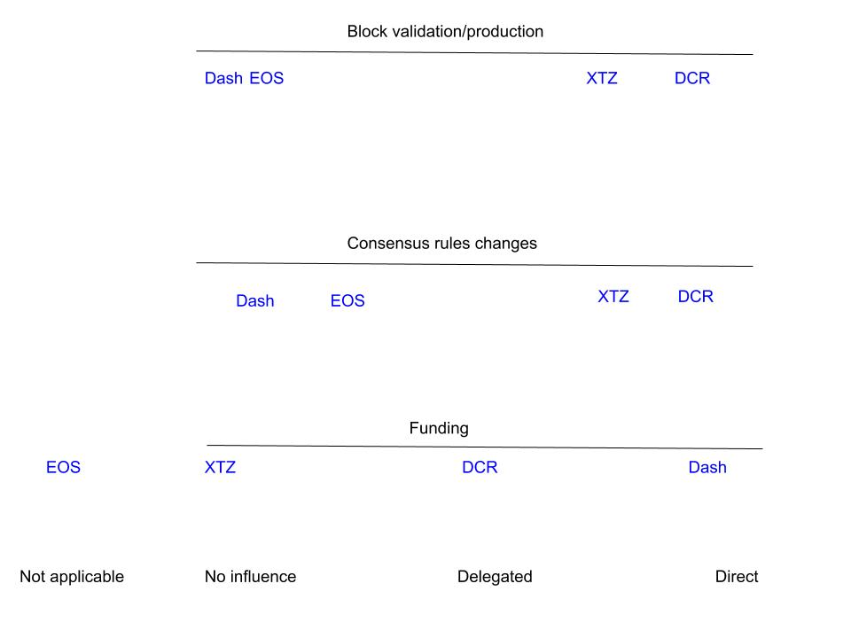

## Draft, this is a work in progress and not ready for publication

This text and accompanying [data-set](staking_overview.csv) (and soon graphic) gives an overview of the role that stakeholders (people who hold the asset and use their holdings to participate in PoS) play in blockchain projects with stake-based governance.

The ways in which stakeholders exercise control of the project can be thought of in terms of 3 broad areas.

1. **Block** production/validation - do stakers have the power to write new blocks to the blockchain or interact directly with it?
2. Changes to the consensus **rules** - do stakers have power to decide whether a change to the consensus rules ("hard fork") is deployed or not?
3. **Funding** - if the project has dedicated funding, do stakers have a role to play in deciding how that money is used?

For the purpose of making this data more accessible, each project will be assigned a numerical score which puts it on a "staker-power" continuum between 0 (no influence at all) to 100 (direct control), with the middle ground representing delegation, either to on-chain entities like elected Block Producers or off-chain entities like Foundations.

The projects described below are each taking a unique approach, and there is considerable variation between these approaches. Even projects that seem to take a broadly similar approach  can have nuanced differences which may turn out to be significant. Reducing these differences down to a set of numbers or labels inevitably loses significant details, so please consider the numbers/graphics and short descriptions as an entry point to a more thorough investigation.

## Decred

Decred uses a PoW/PoS two-factor system, with PoW fulfilling the same purposes as in Bitcoin (ordering transactions) and PoS being used to enhance security and diminish the power of PoW miners. Block rewards are split between PoW miners (60%), Stakers (30%) and a Treasury fund (10%).

To participate in Decred PoS, stakeholders time-lock chunks of DCR in exchange for [tickets](https://docs.decred.org/proof-of-stake/overview/). The funds locked to buy tickets stay locked until those tickets are randomly selected to vote on chain, up to 142 days (but 50% are called within 20 days). The ticket pool has a target size of 40,960 tickets, the price of an individual ticket goes up or down depending on whether the pool is over or under this target, so the number of live tickets at any point in time tends to be close to 40,960

1. **Blocks - 95%, Direct**: Each block randomly calls 5 tickets to vote, and those tickets must vote to approve or reject the previous block's regular transactions. The block is not considered valid unless it has votes from at least 3 tickets - so any chain that the ticket voters are not voting on will not be able to advance. If ticket voters vote no on the block then the miner does not receive their reward, thus giving stake-voters power to determine what is acceptable miner behavior.  Ticket voters also operate a default policy of not voting on any block which would cause a reorg of greater than 6 blocks from the current state - significantly bolstering resistance to reorg attacks. I have scored this 95% instead of 100% because many ticket-holders (around 50%) use Voting Service Providers to vote on their behalf (although determined by the ticket holder).
2. **Rules - 95%, Direct on chain**: Decred has an on chain voting [system](https://docs.decred.org/governance/consensus-rule-voting/overview/) for ratifying changes to the consensus rules and deploying them. Before a vote can begin, 95% of PoW miners and 75% of PoS voters must upgrade to a new version of the software which has the new code. This triggers the start of a one month voting period in which each ticket that is called to vote  on the previous block can also vote Yes or No to the rule change being proposed in the latent code. If at least 75% of the voting tickets vote Yes, then a one month lock in period begins, after which all nodes switch to the latent code. I have scored this 95% instead of 100% because many ticket-holders (around 50%) use Voting Service Providers to vote on their behalf (although determined by the ticket holder).
3. **Funding - 50%, Off chain voting to approve/reject proposals, decisions implemented by humans**: Decred has a [Treasury](https://explorer.dcrdata.org/address/Dcur2mcGjmENx4DhNqDctW5wJCVyT3Qeqkx?chart=balance&zoom=ijhhasg0-jvq6qe80&bin=month&n=20&start=0&txntype=merged_debit) which is funded by 10% of the block reward. Those funds are managed by Decred Holdings Group, which pays contractors for their work on the project (in arrears). Through the [Politeia](https://docs.decred.org/governance/politeia/overview/) [platform](https://proposals.decred.org/), anyone can submit a proposal (costs 0.1 DCR) for how to spend these Treasury funds (or other policy type decisions). Politeia administrators can censor proposals that do not meet minimum requirements, and the proposal submitter receives a censorship token which they can use to demonstrate what was censored. The voting period for proposals lasts for 1 week, and every ticket that was live when voting started can vote Yes/No. For proposals to pass they must have at least 60% Yes votes, and at least 20% of the eligible tickets must vote. I have scored this 50% because stake-voters vote directly on whether to approve proposals, but the payments are made based on whether the DHG judges the work to have been successfully completed. A [proposal](https://proposals.decred.org/proposals/c96290a2478d0a1916284438ea2c59a1215fe768a87648d04d45f6b7ecb82c3f) was recently approved which will see stake-voters approving each monthly Treasury payout with an on chain vote - this will increase the measure of control that stake-voters have over funding when it is completed and deployed.

## Tezos

Tezos uses a Proof of Stake system in which holders with enough XTZ can become "bakers" and produce (bake) new blocks. Holders who do not have enough XTZ to bake themselves, or do not wish to run a baking node, can delegate their XTZ to a baker. The baker can use this delegated XTZ to improve their chances of being selected to bake a block, and bakers typically share a portion of the rewards they receive back to the delegators, minus a [fee](https://mytezosbaker.com/) of ~5-33%. Holders who delegate their XTZ have no formal role to play in the network, bakers are the key actors who produce new blocks and make decisions about consensus rules.

1. **Blocks - 70%, Delegated Proof of Stake (with a large maximum number of block producers)**: bakers are randomly selected to bake blocks, based on the number of "rolls" (lots of 10,000 XTZ) they control. Bakers also participate in endorsing the blocks of other bakers, and these endorsements allow the network to quickly settle on one chain. Bakers put up security deposits when they bake or endorse. Bakers can formally accuse other bakers on chain if they catch them breaking the rules (e.g. double baking, bad endorsements), in which case the accused forfeits their security deposit and the accuser received 50% of this deposit.  I have scored this 70% because direct participation is much more accessible than in DPoS systems (where a limited number of block producers are elected), but delegation is still very common - on 05/21/19 there is 447.5 million XTZ delegated of a total 564.5 million XTZ staked (79%).  
2. **Rules - 70%, DPoS:** Bakers follow a 4 stage [process](https://medium.com/tezos/amending-tezos-b77949d97e1e) to change the consensus rules of the network. In the first phase bakers submit and upvote proposals. When the first phase ends, the most upvoted proposal will progress to phase 2, where it must be approved by at least 80% of bakers. If the criteria are met, this is followed by a testing phase in which a testnet fork with the changes applied is created and runs for 48 hours (a further testnet matching the proposal may be run for the rest of this phase to allow further testing). After the testing phase, bakers vote on whether the changes should be activated, with an 80% supermajority required (adjusts dynamically based on previous participation rates). After this 4th phase the changes are activated (or not) and the cycle begins again with new proposals.
3. **Funding - 20%, Foundation and protocol upgrade bonuses:** The Tezos [Foundation](https://tezos.foundation/) controls the proceeds of the Tezos ICO (worth [approximately](https://cointelegraph.com/news/the-history-of-tezos-the-infamous-ico-trying-to-rebound-amidst-lawsuits-and-disputes) $232 million at the time) and 10% of the initial XTZ tokens, and has a mandate to use these to give "support to Tezos and related technologies as well as to the Tezos community". Bakers and holders have no say in how these ICO funds are used. Protocol upgrades can include the creation of new XTZ tokens from inflation. The first Tezos mainnet upgrade included 100 XTZ tokens so that the developers who produced it could buy a round of drinks, so this mechanism is not playing a significant role in funding Tezos development yet. This kind of funding will be limited to supporting entities that work on the protocol, as contributors to other aspects will not be in a position to bundle inflation XTZ with on chain proposals. I put it at 20% because it is delegated to bakers and limited in what it can support, and so far it hasn't been used for more than a round of drinks. Arthur Breitman has recently [written](https://medium.com/@arthurb/potential-design-for-a-simple-and-evolvable-on-chain-treasury-77cfe2176423) about a design for a simple on chain treasury, which if implemented will extend the influence stakeholders have over the direction development takes. 

## EOS

EOS uses a Delegated Proof of Stake (DPoS) system in which token holders vote with their tokens to elect 21 Block Producers (BPs). EOS is notable among DPoS projects in that it explicitly prohibited payments from BPs to voters (or "vote-buying"), but this [rule](https://cointelegraph.com/news/eos-community-is-challenged-after-node-announces-financial-rewards-for-votes) is already being bent. 

1. Blocks - 25%, Delegated: The 21 Block Producers with the most votes take turns producing blocks. At launch, the EOS Core Arbitration Forum (ECAF) had the power to [blacklist](https://news.bitcoin.com/eos-decentralization-questioned-as-block-producers-freeze-accounts/) addresses and block transactions, which it would do by passing a blacklist to the BPs (who would then refuse to process transactions from those addresses). The blacklist mechanism subsequently broke down when a newly elected BP failed to apply the blacklist and allowed 2.1 million EOS (~$7 million) to be transferred - the BP was subsequently de-selected. The ECAF appears to have been disbanded with the replacement of the EOS constitution.

2. Rules - 45%, Delegated, with signal voting: EOS holders can propose and vote in [referendums](https://eosauthority.com/polls), with BPs implementing the decisions made through these polls. The original constitution set a threshold of 15% participation for a referendum to be valid, so far no referendum proposal has surpassed 3% participation of EOS tokens. In practice, any change to the rules requires 15 or 21 BPs to agree - and this method has been used to implement some changes so far, like the [replacement](https://www.reddit.com/r/eos/comments/bcgk51/the_eos_user_agreement_has_been_approved/) of the constitution with a user agreement, and the [burning](https://www.reddit.com/r/eos/comments/bm75ih/the_mainnet_34m_eos_accumulated_4_inflation_is/) of a fund which had been intended to support development of the project (a "worker proposal system") with 4% annual inflation.

3. Funding - 0%, None. Although 4% inflation is still accruing to a development fund, the burning of accumulated savings, coupled with the lack of any progress towards a Worker Proposal System, suggests that this funding mechanism will ultimately be [removed](https://cryptoslate.com/eos-likely-to-drop-inflation-rate-from-5-to-1/). Block.one received [$4 Billion](https://cointelegraph.com/news/eos-about-to-secure-a-record-4-bln-in-year-long-ico) from the EOS ICO, and although the terms clearly [state](https://eos.io/faq) that Block.one has no obligation to use the funds for anything in particular. In summary, there is no reason to believe that EOS holders have any direct influence over funding for development.

## Dash

Dash uses PoW consensus with a special role for "master nodes" that have collateral of 1000 DASH, they refer to this model as "[Proof of Service](https://docs.dash.org/en/stable/masternodes/understanding.html#proof-of-service)" (PoSe). This can be considered as a form of staking, although technically the DASH is not staked but used as collateral to allow running a node (which must be online and meet certain criteria). 45% of block rewards go to PoW miners, 45% to masternodes, and 10% to a Treasury.

1. Blocks - 50%, LLMQs and ChainLocks. The Dash network recently activated [ChainLocks](https://blog.dash.org/mitigating-51-attacks-with-llmq-based-chainlocks-7266aa648ec9), which is a method that allows the masternodes to prevent reorg attacks (like double spends) on the network. Once a quorum of masternodes attest to having seen the same new valid block, they sign a transaction that locks it in and would reject any chain which does not have this block. This gives masternodes the power to prevent miners from executing a reorg, which is significant, but does not give them any scope to reject other forms of misbehavior by miners.
2. Rules - 20%, Influence through funding. Dash Core group is funded by the Treasury superblocks and has social authority to change the consensus rules. PoW miners and masternodes must upgrade to software that runs the new rules manually, and these activate when a specified threshold is met. Masternodes could in principle defund Dash Core group by rejecting their funding proposals, or could hold a signal vote with a proposal to express rejection of a proposed change. In practice the decision-making power has been delegated to Dash Core, but there are ways in which masternodes could coordinate to reject these changes and replace Dash Core.
3. Funding - 95%, Direct on chain. 10% of all block rewards are dispensed in monthly superblocks. Proposals are made on chain which request a specific amount of DASH to be sent to a specific address. Masternodes vote to approve or reject these proposals, and the top scoring proposals each month are paid out. In practice, some proposals use escrow providers who receive and hold the DASH until the work has been delivered. I have given this 95% because there is some delegation involved with the escrow providers and Dash Core also has considerable autonomy.